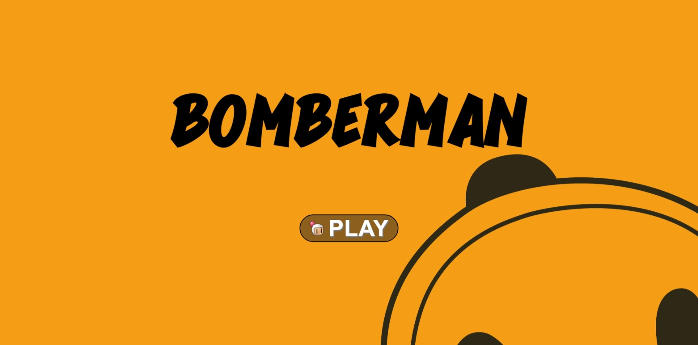
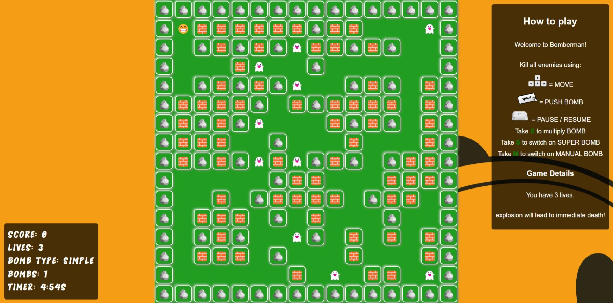

# 💣 BOMBERMAN GAME

|Launch Page|Game Page|
:-:|:-:
|

A simple Bomberman game implemented in HTML, CSS, and Vanilla JavaScript.

## TABLE OF CONTENTS

- [💣 BOMBERMAN GAME](#-bomberman-game)
  - [TABLE OF CONTENTS](#table-of-contents)
  - [FEATURES](#features)
  - [DEMO](#demo)
  - [GETTING STARTED](#getting-started)
    - [PREREQUISITES](#prerequisites)
    - [INSTALLATION](#installation)
  - [AUTHORS](#authors)

## FEATURES

- Classic Bomberman gameplay.
- Smooth animation and responsive controls.
- Pause menu with options to continue or restart the game.
- Scoreboard displaying timer, score, and lives.

## DEMO

Link to the [live demo](https://bomberman-mu.vercel.app/) of the game

## GETTING STARTED

### PREREQUISITES

To play the game locally, you'll need a web browser.

### INSTALLATION

1. Clone this repository or download the ZIP file.

2. Open `index.html` in your web browser.

3. Start playing!

## AUTHORS
+  Serigne Saliou Mbacké MBAYE (@serignmbaye)
+  Abdou Karim SOW (@abdouksow)
+  Ivan Yossanguem (@iyossang)
